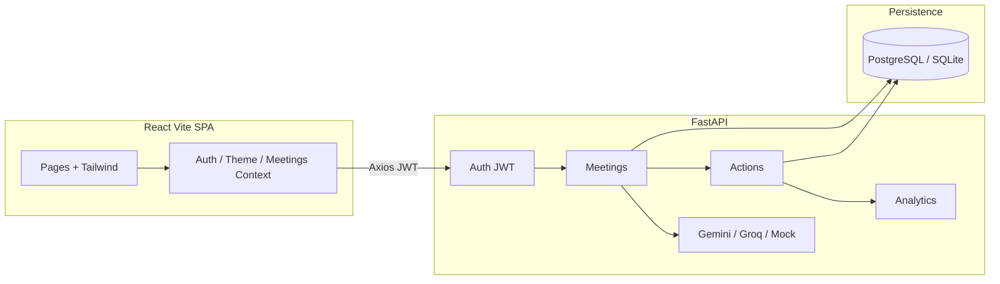

# SynapNotes AI

[](https://fastapi.tiangolo.com/)
[](https://react.dev/)
[](https://tailwindcss.com/)
[](https://ai.google.dev/)

AI-powered meeting notes and action tracker. Paste or upload a transcript, extract structured summaries / decisions / risks, and manage follow-ups on a Kanban or table.

## Architecture



## Demo accounts

| Role | Email | Password |
| --- | --- | --- |
| Team Lead (admin) | `admin@zignuts.com` | `adminpass123` |
| Member | `member@zignuts.com` | `memberpass123` |

On first boot the API seeds these users plus three meetings, including **Project Discovery and MVP Planning Meeting (Customer Support Automation Platform)** with Zendesk-adapter decisions and live action items.

## Environment variables

| Variable | Where | Purpose |
| --- | --- | --- |
| `DATABASE_URL` | backend | PostgreSQL URL. `postgres://` is rewritten to `postgresql://`. Empty or failing URLs fall back to `sqlite:///./synapnotes.db`. |
| `SECRET_KEY` | backend | JWT signing secret |
| `ACCESS_TOKEN_EXPIRE_MINUTES` | backend | Token lifetime (default 720) |
| `GEMINI_API_KEY` | backend | Google Gemini (`gemini-2.5-flash`, with fallbacks) |
| `GEMINI_MODEL` | backend | Optional preferred Gemini model id |
| `GROQ_API_KEY` | backend | Groq fallback (`llama-3.3-70b-versatile`) |
| `VITE_API_URL` | frontend | API origin. Leave empty to use Vite/nginx proxy |

If both AI keys are missing or providers error, the deterministic mock engine still returns valid JSON.

## Local setup (macOS)

```bash
cd synapnotes-ai

# Backend
cd backend
python3.11 -m venv .venv
source .venv/bin/activate
pip install -r requirements.txt
cp .env.example .env
uvicorn app.main:app --reload --port 8000

# Frontend (new terminal)
cd frontend
cp .env.example .env
npm install
npm run dev
```

Open [http://localhost:5173](http://localhost:5173). Vite proxies `/api` and `/health` to port 8000.

## Local setup (Windows)

```powershell
cd synapnotes-ai\backend
py -3.11 -m venv .venv
.venv\Scripts\activate
pip install -r requirements.txt
copy .env.example .env
uvicorn app.main:app --reload --port 8000

cd ..\frontend
copy .env.example .env
npm install
npm run dev
```

## Docker

```bash
docker compose up --build
```

- Frontend: [http://localhost:3000](http://localhost:3000) (nginx SPA rewrite + `/api` proxy)
- Backend: [http://localhost:8000](http://localhost:8000)
- Health: [http://localhost:8000/health](http://localhost:8000/health)

## API endpoints

| Method | Path | Description |
| --- | --- | --- |
| GET | `/health` | `{ status, system, version }` |
| POST | `/api/auth/register` | Create member account |
| POST | `/api/auth/login` | JWT login |
| GET | `/api/auth/me` | Current user |
| GET | `/api/meetings` | List (`search`, `meeting_type`) |
| POST | `/api/meetings` | Create + AI extract |
| GET | `/api/meetings/{id}` | Detail |
| PUT | `/api/meetings/{id}` | Update |
| DELETE | `/api/meetings/{id}` | Delete |
| POST | `/api/meetings/{id}/reprocess-ai` | Re-run extraction |
| GET | `/api/actions` | Filter `meeting_id`, `status`, `priority`, `owner`, `overdue` |
| POST | `/api/actions` | Manual task |
| PUT | `/api/actions/{id}` | Edit owner/status/priority/due |
| DELETE | `/api/actions/{id}` | Delete |
| GET | `/api/analytics/dashboard` | Metrics + recent meetings |

All `/api/*` routes except register/login require `Authorization: Bearer <token>`. Admins see the full workspace; members are scoped to their own meetings.

## Theme

Tailwind `darkMode: 'class'` with a Navbar sun/moon toggle. Preference is stored in `localStorage` (`synapnotes_theme`).
